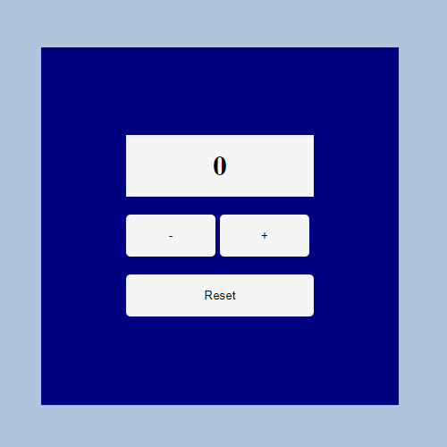

## Redux Toolkit Simple Counter

#### In this project, a simple counter application was made using the following technologies.

- React
- Redux Toolkit

#### You can download the libraries to your local with the command below.

`npm install`

#### You can then run the application with this command.

`npm start`

